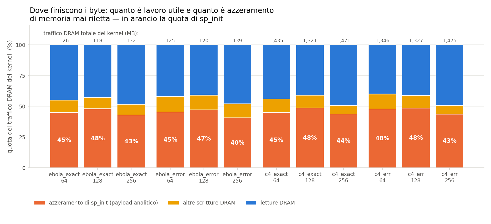
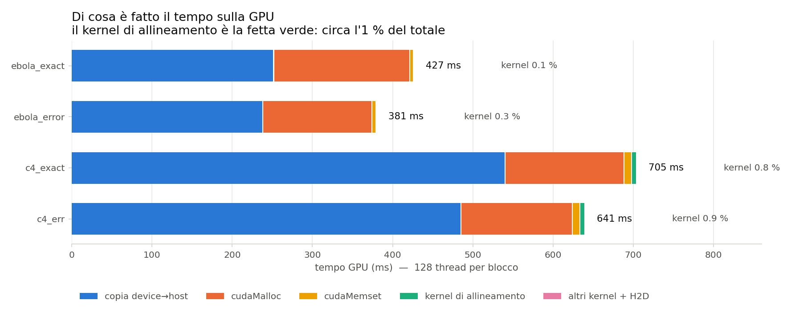
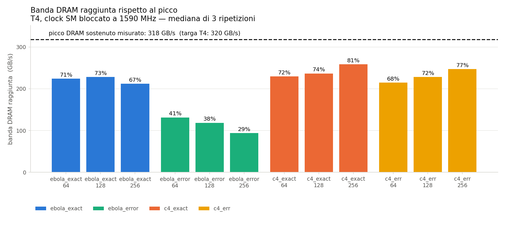
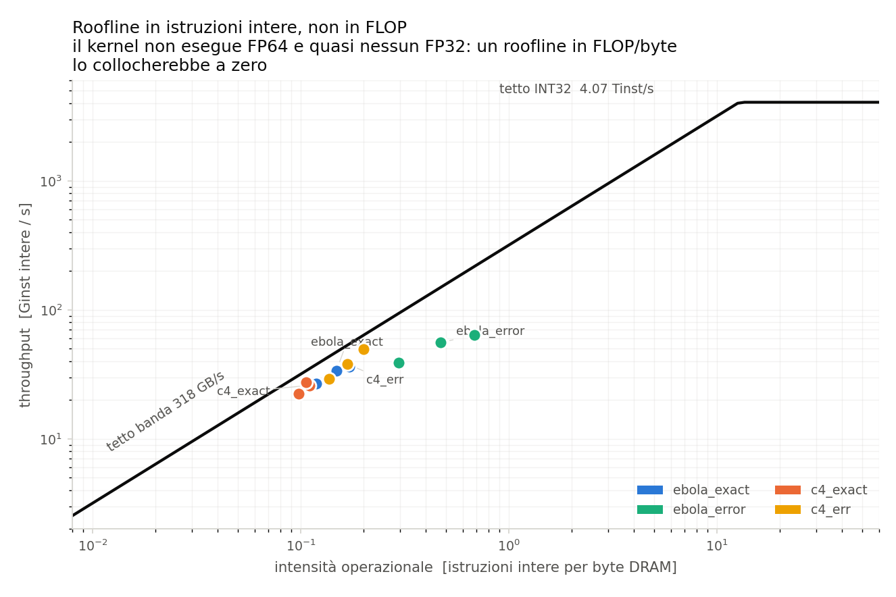

# Baseline di profiling della GPU naive — Theseus sequence-to-graph

Commit misurato: **`88ddef2225d5d72cdee194b9e4abcc24606f7ef6`** — validato in Fase A,
nessuna modifica al codice.

**In una riga:** il kernel è confermato bandwidth-bound (DRAM 67–81 % del picco T4
contro SM 2,8–3,7 %), e il 43–48 % di tutto il traffico DRAM è l'azzeramento di
`sp_init`, memoria che nessuno rilegge — quota che sale al **78–86 % se si guardano
le sole scritture**, che è la forma in cui la cifra storica dell'80 % era stata
scritta.

**Ogni numero di questo report è tracciabile a un file archiviato qui accanto.** Dove
un dato manca, è scritto che manca.

---

## 1. Contesto e stato validato

### 1.1 Cosa è stato validato

`7bb6479` ("Convenzione indici thread", 203 righe di `align_gpu.cu`) non era mai passato
per `nvcc`. È stato compilato e sottoposto a regressione completa: **12 combinazioni su
12 verdi**, output byte per byte identico ai golden dell'oracle CPU (SHA-256 coincidenti).
Dettaglio in [`00_regressione.md`](00_regressione.md).

La modifica si è rivelata un refactor puramente meccanico (`threadIdx.x`/`blockDim.x`
sostituiti da due locali `tx`/`ntx`), e non è stato necessario toccare una riga per farla
compilare o passare.

### 1.2 Ambiente

| | |
|---|---|
| GPU | **Tesla T4**, CC 7.5, 40 SM, 15360 MiB |
| Driver | 580.82.07 |
| CUDA toolkit | 12.8.93 (`sm_75`, `-DCMAKE_CUDA_ARCHITECTURES=75`) |
| Nsight Compute | 2025.1.1.0 |
| Clock SM | **bloccato a 1590 MHz** (`nvidia-smi -lgc`, riuscito) |
| Clock memoria | 5001 MHz (non regolabile) |

L'architettura assegnata **è** la T4 su cui sono state prese le misure storiche, quindi il
confronto della §6 è diretto. Procedura di ricostruzione completa in
[`env/setup_colab.md`](dati_grezzi/env/setup_colab.md).

### 1.3 Le due regie di clock, e perché ce ne sono due

`ncu` di default impone `--clock-control base`, che **blocca la GPU al clock base della
T4 (585 MHz)** ignorando il blocco a 1590 MHz fatto con `nvidia-smi`. È ottimo per la
riproducibilità e pessimo per rappresentare la macchina in esercizio.

Sono state quindi eseguite **due passate complete**, ciascuna dataset × {64,128,256} × 3
ripetizioni:

| passata | come | dove | ruolo |
|---|---|---|---|
| **boost** | `--clock-control none`, clock bloccati da noi a 1590 MHz | [`clock-1590MHz/`](../../profile-cuda/nsight-compute/clock-1590MHz), [`clock-1590MHz/ (CSV)`](../../profile-cuda/nsight-compute/clock-1590MHz) | **baseline primaria** |
| **base** | default di `ncu`, 585 MHz | [`clock-base/`](../../profile-cuda/nsight-compute/clock-base) — **solo CSV**, i `.ncu-rep` non sono versionati | riproducibilità e confronto con lo storico |

Salvo indicazione contraria, **tutti i numeri di questo report vengono dalla passata
boost**. La passata base serve alla §6, dove si rivela la chiave per spiegare i numeri
storici.

### 1.4 Cosa è stato misurato, esattamente

`align_batch_gpu` lancia `theseus_align_batch_kernel` **una sola volta** per invocazione
(`src/gpu/align_gpu.cu:1537`), con `gridDim = num_seqs` (un blocco per query) e
`blockDim = threads_per_block`. Quindi `--launch-count 1` cattura tutto il lavoro di
allineamento del processo, e non c'è nessun ciclo di batch da mediare.

`ebola_*` = 256 query da 100 bp su un grafo CSR di 14 vertici / 37 850 basi / 16 archi;
`c4_*` = 512 query da 100 bp su 32 vertici / 329 664 basi / 44 archi. Le lunghezze
massime dei vertici nel GFA sono 9 063 bp (ebola) e 52 006 bp (c4), da cui lo span dello
ScratchPad: 9 164 e 52 107.

---

## 2. Tabelle comparative

Mediana di 3 ripetizioni; la dispersione è `(max − min) / mediana`. Sorgente:
[`profile-cuda/nsight-compute/clock-1590MHz/<dataset>_<thread>_run<N>.csv`](../../profile-cuda/nsight-compute/clock-1590MHz), aggregate in [`agg.json`](dati_grezzi/agg.json).

### 2.1 Tempo e throughput — passata boost (1590 MHz)

| dataset | thr | durata kernel (µs) | disp. | DRAM % picco | DRAM GB/s | SM % picco | L1 hit % | L2 hit % |
|---|---:|---:|---:|---:|---:|---:|---:|---:|
| ebola_exact_smoke | 64 | 556,6 | 3,8 % | 70,6 | 224,1 | 2,83 | 69,5 | 67,6 |
| ebola_exact_smoke | **128** | **519,6** | 1,0 % | 73,1 | 228,0 | 2,98 | 69,7 | 67,4 |
| ebola_exact_smoke | 256 | 622,9 | 1,5 % | 67,3 | 212,0 | 2,86 | 69,1 | 65,6 |
| ebola_error_smoke | **64** | **947,4** | 1,2 % | 41,2 | 131,4 | 4,80 | 72,5 | 75,0 |
| ebola_error_smoke | 128 | 1010,0 | 3,3 % | 37,6 | 118,6 | 5,41 | 72,9 | 75,3 |
| ebola_error_smoke | 256 | 1480,0 | 0,0 % | 29,4 | 93,9 | 4,90 | 73,1 | 72,7 |
| c4_exact | 64 | 6250,0 | 0,3 % | 71,6 | 229,6 | 2,84 | 68,3 | 65,9 |
| c4_exact | **128** | **5600,0** | 0,7 % | 74,0 | 236,5 | 3,01 | 68,6 | 67,3 |
| c4_exact | 256 | 5690,0 | 0,2 % | 81,2 | 258,7 | 2,94 | 69,3 | 65,1 |
| c4_err | 64 | 6290,0 | 0,0 % | 67,5 | 214,7 | 2,97 | 68,9 | 70,5 |
| c4_err | **128** | **5820,0** | 1,7 % | 71,7 | 228,3 | 3,06 | 69,3 | 69,1 |
| c4_err | 256 | 5960,0 | 0,8 % | 77,5 | 247,2 | 3,70 | 70,1 | 66,4 |

In grassetto la configurazione più veloce per dataset. **La dispersione è ≤ 3,8 % ovunque
e sotto il 2 % in dieci casi su dodici**: il blocco dei clock a 1590 MHz ha funzionato, e
questi numeri non sono rumore termico.

Il picco DRAM sostenuto **misurato** — ricavato dai dati di `ncu` stessi come
`GB/s ÷ (DRAM % ÷ 100)` — è **317,7 GB/s**, contro i 320 GB/s di targa della T4. Le
percentuali sopra sono quindi riferite a un picco reale, non nominale.

### 2.2 Traffico DRAM e attribuzione a `sp_init`

| dataset | thr | letture MB | scritture MB | totale MB | `sp_init` MB (analitico) | su totale | su scritture |
|---|---:|---:|---:|---:|---:|---:|---:|
| ebola_exact_smoke | 64 | 57,0 | 69,0 | 126,1 | 56,3 | 44,7 % | 81,6 % |
| ebola_exact_smoke | 128 | 51,0 | 67,1 | 118,1 | 56,3 | 47,7 % | 83,9 % |
| ebola_exact_smoke | 256 | 64,3 | 67,8 | 132,1 | 56,3 | 42,6 % | 83,1 % |
| ebola_error_smoke | 64 | 52,8 | 72,0 | 124,8 | 56,3 | 45,1 % | 78,2 % |
| ebola_error_smoke | 128 | 49,4 | 70,7 | 120,0 | 56,3 | 46,9 % | 79,7 % |
| ebola_error_smoke | 256 | 67,3 | 72,0 | 139,3 | 56,3 | 40,4 % | 78,2 % |
| c4_exact | 64 | 637,1 | 798,2 | 1435,3 | 640,3 | 44,6 % | 80,2 % |
| c4_exact | 128 | 545,3 | 775,3 | 1320,6 | 640,3 | 48,5 % | 82,6 % |
| c4_exact | 256 | 728,0 | 742,7 | 1470,7 | 640,3 | 43,5 % | 86,2 % |
| c4_err | 64 | 542,7 | 802,9 | 1345,6 | 640,3 | 47,6 % | 79,7 % |
| c4_err | 128 | 550,6 | 776,8 | 1327,4 | 640,3 | 48,2 % | 82,4 % |
| c4_err | 256 | 729,0 | 745,9 | 1475,0 | 640,3 | 43,4 % | 85,8 % |



### 2.3 Stall, efficienza SIMD, memoria

`stall X` = cicli-warp in stallo su X per issue attivo (`smsp__average_warps_issue_
stalled_*_per_issue_active.ratio`). `thr/warp` = thread attivi per istruzione warp, su 32.
`sett/ric` = settori per richiesta.

| dataset | thr | stall `lg_throttle` | stall barriera | stall `long_sb` | stall `mio_throttle` | thr/warp | sett/ric store | sett/ric load |
|---|---:|---:|---:|---:|---:|---:|---:|---:|
| ebola_exact_smoke | 64 | 97,9 | 25,0 | 14,6 | 0,17 | 17,3 | 19,1 | 1,01 |
| ebola_exact_smoke | 128 | 72,9 | 41,0 | 9,8 | 0,09 | 19,1 | 19,0 | 1,00 |
| ebola_exact_smoke | 256 | 85,3 | 29,9 | 4,9 | 0,03 | 21,6 | 19,0 | 1,00 |
| ebola_error_smoke | 64 | 18,8 | 9,8 | 4,0 | 0,07 | 13,7 | 16,3 | 1,31 |
| ebola_error_smoke | 128 | 6,6 | 16,6 | 2,0 | 0,03 | 16,3 | 16,3 | 1,27 |
| ebola_error_smoke | 256 | 5,2 | 25,6 | 0,9 | 0,02 | 19,0 | 16,3 | 1,21 |
| c4_exact | 64 | 234,9 | 61,2 | 21,8 | 0,86 | 26,9 | 23,3 | 1,02 |
| c4_exact | 128 | 167,9 | 88,4 | 18,9 | 0,48 | 27,1 | 23,2 | 1,02 |
| c4_exact | 256 | 228,0 | 26,6 | 8,1 | 0,01 | 27,4 | 23,2 | 1,01 |
| c4_err | 64 | 85,0 | 26,9 | 16,2 | 0,58 | 19,1 | 22,4 | 1,33 |
| c4_err | 128 | 48,1 | 40,3 | 8,8 | 0,27 | 20,0 | 22,3 | 1,28 |
| c4_err | 256 | 35,1 | 31,1 | 2,6 | 0,02 | 21,2 | 22,3 | 1,22 |

`lg_throttle` — la pipe load/store satura — **domina ovunque tranne che su
`ebola_error_smoke`**, dove il primo stall è la barriera. È l'unico dataset del gruppo che
non è limitato dalla banda, e la §5 spiega perché.

I 16–23 settori per richiesta di store **non sono scatter**: 32 thread che scrivono
`Cell` da 24 B contigue coprono 768 B = 24 settori, quindi ~23 è il valore atteso per una
scrittura AoS perfettamente contigua. Il load è a 1,0–1,3 settori per richiesta, cioè
sostanzialmente perfetto. **La coalescenza non è il problema; il volume sì.**

### 2.4 Occupancy e risorse

Identiche su tutti e quattro i dataset — dipendono solo dal blocco:

| thr/blocco | reg/thread | blocchi/SM: limite registri | limite shared | limite warp | **blocchi residenti** | warp/SM | occ. teorica | occ. raggiunta | smem statica | smem dinamica | wave/SM (ebola / c4) |
|---:|---:|---:|---:|---:|---:|---:|---:|---:|---:|---:|---:|
| 64 | 239 | **4** | 12 | 16 | **4** | 8 | 25 % | 21,1–25,3 % | 368 B | 2,05 KB | 1,6 / 3,2 |
| 128 | 239 | **2** | 7 | 8 | **2** | 8 | 25 % | 23,3–25,3 % | 368 B | 4,10 KB | 3,2 / 6,4 |
| 256 | 239 | **1** | 3 | 4 | **1** | 8 | 25 % | 24,8–25,0 % | 368 B | 8,19 KB | 6,4 / 12,8 |

**L'occupancy teorica è inchiodata al 25 % da 239 registri per thread**, e da nient'altro:
il limite dei registri è sempre il più stretto dei quattro. Il prodotto
`blocchi residenti × warp per blocco` fa 8 warp per SM in tutte e tre le configurazioni,
cioè 8 su 32 possibili. L'occupancy raggiunta insegue quella teorica entro 4 punti, quindi
non c'è coda di svuotamento significativa. **Cambiare i thread per blocco non cambia
l'occupancy**: sposta solo come quegli 8 warp sono distribuiti fra i blocchi.

### 2.5 Tempo end-to-end, senza profiler

Cinque ripetizioni per combinazione, senza `ncu`, clock a 1590 MHz.
Sorgente: [`logs/timing_clean.log`](dati_grezzi/logs/timing_clean.log), aggregato in
[`timing.json`](dati_grezzi/timing.json). `h2d`/`kernel`/`d2h` sono i valori riportati
dall'applicazione via CUDA event; `wall` è il processo intero, parsing GFA e verifica CPU
compresi.

| dataset | thr | wall (s) | h2d (ms) | kernel (ms) | **d2h (ms)** | totale GPU (ms) | quota del kernel |
|---|---:|---:|---:|---:|---:|---:|---:|
| ebola_exact_smoke | 64 | 1,231 | 4,93 | 0,90 | **238,1** | 243,9 | 0,4 % |
| ebola_exact_smoke | 128 | 1,232 | 4,92 | 0,84 | **238,8** | 244,6 | 0,3 % |
| ebola_exact_smoke | 256 | 1,225 | 4,93 | 0,93 | **240,2** | 246,1 | 0,4 % |
| ebola_error_smoke | 64 | 1,233 | 4,93 | 1,31 | **241,8** | 248,0 | 0,5 % |
| ebola_error_smoke | 128 | 1,250 | 4,93 | 1,31 | **241,2** | 247,5 | 0,5 % |
| ebola_error_smoke | 256 | 1,233 | 4,92 | 1,80 | **240,2** | 246,9 | 0,7 % |
| c4_exact | 64 | 2,232 | 9,78 | 6,64 | **483,3** | 499,7 | 1,3 % |
| c4_exact | 128 | 2,221 | 9,77 | 6,02 | **475,9** | 491,6 | 1,2 % |
| c4_exact | 256 | 2,226 | 9,77 | 6,09 | **481,4** | 497,3 | 1,2 % |
| c4_err | 64 | 2,238 | 9,77 | 6,68 | **484,3** | 500,8 | 1,3 % |
| c4_err | 128 | 2,248 | 9,77 | 6,27 | **483,7** | 499,8 | 1,3 % |
| c4_err | 256 | 2,237 | 9,76 | 6,30 | **478,1** | 494,1 | 1,3 % |

I `kernel (ms)` da CUDA event sono coerenti con le durate misurate da `ncu` (§2.1) più il
`seq_length_kernel` e il costo di lancio e sincronizzazione: 6,27 ms contro 5,82 ms per
`c4_err@128`.

**Il risultato più forte di questa tabella non riguarda il kernel.** Il kernel è
l'0,3–1,3 % del tempo GPU. Il resto è la copia D2H, che riporta a host l'intero array di
`QueryState`: 4,2 MB per query, cioè 1,07 GB per un batch da 256 e 2,15 GB per uno da
512, a ~4,4 GB/s su PCIe con memoria paginabile. **Ottimizzare il kernel senza toccare la
D2H sposta l'1 % del tempo end-to-end.** Il collo di bottiglia del *kernel* e quello
dell'*applicazione* sono due cose diverse, ed è un punto che vale la pena tenere separato
nelle conclusioni.

Nota di misura: sotto `ncu` la stessa riga di CUDA event riporta `kernel = 460–542 ms`
invece di 0,8–6,7 ms. È sovraccarico di strumentazione del profiler, non lavoro: la durata
vera del kernel è quella misurata da `ncu` stesso con `gpu__time_duration.sum`. Per questo
i tempi end-to-end sono stati raccolti in una passata separata **senza** profiler.

### 2.6 La stessa scomposizione misurata da Nsight Systems

I CUDA event della §2.5 sono strumentazione dell'applicazione: dicono quanto dura una
fase, ma non da cosa è fatta. Lo strumento NVIDIA per quella domanda è **Nsight Systems**,
eseguito su tutti e quattro i dataset a 128 thread con
`nsys profile --trace=cuda,osrt --cuda-memory-usage=true`.
Report in [`risultati/report_nsys/`](../../profile-cuda/nsight-systems), riepiloghi testuali già
pronti accanto a ciascuno (`.stats.txt`), tabella in
[`risultati/tabelle/7_tempo_gpu_nsys.csv`](risultati/tabelle/7_tempo_gpu_nsys.csv).

| dataset (@128) | copia D2H | `cudaMalloc` | `cudaMemset` | **kernel allineam.** | altri kernel + H2D | totale GPU | kernel % |
|---|---:|---:|---:|---:|---:|---:|---:|
| ebola_exact_smoke | 252,3 ms | 169,4 ms | 4,85 ms | **0,51 ms** | 0,09 ms | 427,2 ms | **0,12 %** |
| ebola_error_smoke | 238,9 ms | 136,0 ms | 4,85 ms | **0,99 ms** | 0,09 ms | 380,8 ms | **0,26 %** |
| c4_exact | 540,7 ms | 148,3 ms | 9,67 ms | **5,67 ms** | 0,45 ms | 704,8 ms | **0,80 %** |
| c4_err | 486,0 ms | 138,6 ms | 9,67 ms | **5,91 ms** | 0,45 ms | 640,6 ms | **0,92 %** |



Conferma la §2.5 con uno strumento indipendente — 5,91 ms di kernel su `c4_err` contro i
5,82 ms di `ncu` e i 6,27 dei CUDA event — e aggiunge **due voci che non avevo misurato**:

- **`cudaMalloc` costa 136–169 ms**, cioè il 21–40 % del tempo GPU. Allocare i
  2,26 GB di `QueryState` non è gratis, e i §2.5 lo nascondevano perché cade fuori
  dall'intervallo fra i due CUDA event. Su `ebola` è la voce più cara dopo la D2H, e su
  quel dataset la `QueryState` allocata è di 1,13 GB per 256 query da 100 bp.
- **La `cudaMemset(d_states, …)` di `align_gpu.cu:1515` costa 4,85–9,67 ms**, cioè da sola
  **più del kernel** su tre dataset su quattro. Era annotata in §8 come non misurata:
  ora lo è. Scrive 2,26 GB, gli stessi byte che la D2H riporterà indietro.

`nsys` conferma anche che i kernel sono tre e uno solo conta: su `c4_err`
`theseus_align_batch_kernel` è il 93,5 % del tempo di kernel, `graph_readback_kernel`
(la verifica del CSR sul device) il 6,5 %, `seq_length_kernel` lo 0,003 %.

Il quadro completo, quindi: **il kernel su cui verte tutto il lavoro di ottimizzazione è
fra lo 0,1 % e lo 0,9 % del tempo che la GPU passa a lavorare per questa applicazione.**
Il 96–99 % è allocare, azzerare e ricopiare indietro una struttura da 2,26 GB.

---

## 3. Dove finisce il tempo, dove finiscono i byte

### 3.1 Il kernel è bandwidth-bound. Confermato.

Su tre dataset su quattro: **DRAM al 67–81 % del picco, SM al 2,8–3,7 %**. Il rapporto è
di oltre 20 a 1. Le unità di calcolo sono ferme ad aspettare la memoria, e lo stall
dominante (`lg_throttle`, fino a 234,9) dice esattamente questo: la pipe load/store è
satura.



L'eccezione è `ebola_error_smoke`, che sta al 29–41 % di banda: lì il limite non è la
banda ma la barriera e la divergenza (thr/warp scende a 13,7 su 32, il valore peggiore di
tutta la matrice). È il dataset più piccolo per grafo e più irregolare per lavoro, e non
riesce a saturare nulla.

### 3.2 Quanto del traffico è lavoro utile e quanto è azzeramento

**La risposta: fra il 40 % e il 48 % del traffico DRAM del kernel è l'azzeramento di
`sp_init`, cioè memoria che nessuno rilegge.** Sulle sole scritture la quota è
**78–86 %**.

Il calcolo analitico è diretto. `sp_init` scrive `span` celle per query, dove
`span = max_vertex_len + query_len + 1` (`src/query_state.h:322`, con
`min_diag = −query_len` e `max_diag = max_vertex_len` da `align_gpu.cu:1052`), e
`sizeof(Cell) = 24` B (`prev_pos` int64 + tre int32 + un int8, allineato a 8):

- **ebola**: 256 query × 9 164 celle × 24 B = **56,30 MB**
- **c4**: 512 query × 52 107 celle × 24 B = **640,29 MB**

Il ciclo è a `src/gpu/align_gpu.cu:1072`, distribuito sul blocco, e viene eseguito
**una volta per query** — non per vertice: i reset per vertice (`sp_reset_block`,
`align_gpu.cu:639`) toccano solo le diagonali attive.

### 3.3 Verifica indipendente: attribuzione per riga sorgente

Il calcolo analitico e il profiling per riga sono stati fatti separatamente e poi
confrontati, come richiesto.

Per l'attribuzione serve `-lineinfo`, che cambia il binario. Perciò è stata costruita una
**seconda build separata** (`build-gpu-lineinfo`, stessi flag più `-lineinfo`), e — perché
l'attribuzione descrivesse lo stesso comportamento del binario di baseline — quella build
è stata a sua volta passata in regressione: **4 dataset su 4, 12 combinazioni verdi**
([`logs/regressione_lineinfo.log`](dati_grezzi/logs/regressione_lineinfo.log)). Tutte le misure delle
§2 vengono comunque da `build-gpu`, il binario validato in Fase A.

Metrica: `L2 Theoretical Sectors Global` per riga CUDA, esportata con
`ncu --page source --print-source cuda,sass --csv` da [`srcattr/`](../../profile-cuda/nsight-compute/lineinfo) e aggregata da
[`srcattr.py`](dati_grezzi/script/srcattr.py). `ncu` riporta due varianti: *Theoretical* conta i settori
toccati da ogni richiesta, *Ideal* conta i settori minimi necessari per i byte richiesti.

| dataset (@128) | totale teorico | totale ideale | riga 1072 teorico | riga 1072 **ideale** | quota riga 1072 |
|---|---:|---:|---:|---:|---:|
| ebola_exact_smoke | 178,3 MB | 63,5 MB | 171,1 MB | **56,3 MB** | **95,98 %** |
| ebola_error_smoke | 199,9 MB | 80,1 MB | 171,1 MB | **56,3 MB** | **85,58 %** |
| c4_exact | 1960,2 MB | 654,8 MB | 1945,9 MB | **640,5 MB** | **99,27 %** |
| c4_err | 2003,3 MB | 687,5 MB | 1945,9 MB | **640,5 MB** | **97,13 %** |

La riga in questione è, in tutti i casi:

```cpp
// src/gpu/align_gpu.cu:1072
qs.sp_wf[i] = Cell{-1, -1, -1, -1, Cell::Matrix::None};
```

**Scarto fra analitico e misurato: 0,0 % su ebola (56,30 contro 56,3 MB) e 0,03 % su c4
(640,29 contro 640,5 MB).** Ben sotto la soglia del 10 % oltre la quale il prompt chiedeva
di dichiarare la divergenza: i due metodi coincidono. Le seconde righe della classifica
sono tre ordini di grandezza sotto (`align_gpu.cu:366` con 3,3 MB su c4_err, cioè lo
0,16 %).

### 3.4 Un terzo del traffico non è spiegato dalle letture del programma

Un fatto che il calcolo analitico non prevede e che le misure impongono di riportare.

Prendendo `c4_err@128`: le richieste di lettura globale a livello L1 sono 1 072 102
settori (34,3 MB) e quelle di memoria locale 335 613 settori (10,7 MB), per un fabbisogno
di lettura di **~45 MB**. Le letture DRAM misurate sono **550,6 MB**: dodici volte tanto.

L'unico meccanismo che genera letture DRAM senza richieste di lettura dall'SM è il
**riempimento dei settori scritti solo parzialmente**: quando una scrittura non copre per
intero un settore da 32 B, L2 deve prima leggerlo dalla DRAM. La forma di `Cell` lo rende
plausibile — `prev_pos` (8 B) + tre int32 (12 B) + un int8 (1 B) = 21 byte scritti su 24,
con **tre byte di padding a fine struttura che nessuno store scrive mai** — ma il
meccanismo **non è stato verificato direttamente**, e questo report non lo presenta come
accertato: è la spiegazione compatibile con i numeri, non una misura.

Il rapporto letture/scritture è stabile su tutta la matrice (0,68–0,98), il che è coerente
con un fenomeno legato al percorso di scrittura e non al lavoro di allineamento.

Verificarlo, e ridurlo, è **fuori dallo scopo di questa sessione** (tocca il layout dati,
classe esplicitamente vietata). È annotato nella §8.

### 3.5 Il traffico non dipende dal lavoro di allineamento

Tre controlli incrociati che confermano che il traffico è dominato da una costante, non
dall'algoritmo:

1. `c4_exact` (score 0, nessun wavefront non banale) e `c4_err` (con errori, wavefront a
   score non nullo) scrivono **775,3 e 776,8 MB** a 128 thread: uno scarto dello 0,2 %,
   nonostante il secondo esegua il 52 % di istruzioni intere in più (221,7 M contro
   145,6 M).
2. Rapporto c4/ebola: **previsto 640,29/56,30 = 11,37×**, **misurato sulle scritture
   775,3/67,1 = 11,55×**. Scarto 1,6 %.
3. La quota di `sp_init` sulle scritture resta nella stessa banda (78–86 %) su due grafi i
   cui span differiscono di 5,7×.

---

## 4. Roofline

### 4.1 Perché il Roofline standard qui non dice niente

`ncu --set full` raccoglie la sezione Roofline e i file [`raw/*.ncu-rep`](../../profile-cuda/nsight-compute/clock-1590MHz) la
contengono: chi vuole il grafico nativo lo apre con `ncu-ui`. **La CLI di Nsight Compute
non sa esportarlo come immagine**, quindi qui non c'è un PNG generato da `ncu`; il dato è
archiviato nel `.ncu-rep`.

Vale però la pena dire perché quel grafico sarebbe comunque quasi inutile. Il Roofline di
Nsight è in FLOP per byte, e questo kernel **non esegue FP64 e quasi nessun FP32**
(misurato, [`opmix/`](../../profile-cuda/nsight-compute/metriche-mirate)): su `c4_err@128`, 221 671 853 istruzioni-thread intere
contro 1 063 234 FP32 e **0** FP64. In FLOP/byte il kernel sarebbe un punto schiacciato a
zero.

### 4.2 Roofline in operazioni intere, e come è calcolato

Definizione dichiarata, così com'è stata calcolata:

- **intensità operazionale** = `sm__sass_thread_inst_executed_op_integer_pred_on.sum`
  ÷ (`dram__bytes_read.sum` + `dram__bytes_write.sum`), cioè istruzioni intere a livello
  di *thread*, predicate attive, per byte DRAM;
- **throughput** = le stesse istruzioni ÷ durata del kernel (`gpu__time_duration.sum`);
- **tetto banda** = 317,7 GB/s (picco sostenuto misurato, §2.1);
- **tetto calcolo** = 40 SM × 64 core INT32 per SM × 1,59 GHz = **4,07 Tinst/s**.



Dati in [`roofline/roofline_data.csv`](risultati/tabelle/6_dati_roofline.csv).

L'intensità sta fra **0,098 e 0,68 istruzioni intere per byte**, e il punto di ginocchio
del roofline è a 4,07 Tinst/s ÷ 317,7 GB/s = **12,8 inst/byte**. Il kernel è quindi da 19
a 130 volte **a sinistra** del ginocchio: è nella regione limitata dalla banda con ampio
margine, e nessuna ottimizzazione del calcolo può spostarlo. La conclusione della §3.1 è
la stessa vista da qui.

La distanza verticale dal tetto è una verifica di coerenza sull'intera catena di misura.
Per costruzione il rapporto fra throughput raggiunto e tetto vale

```
   y / tetto  =  (istr / durata) / (banda_picco × istr / byte)  =  byte / (durata × banda_picco)
```

cioè **esattamente la banda raggiunta in frazione del picco**. E infatti i due valori
coincidono su tutte e dodici le combinazioni: 0,713 contro 70,56 % su
`ebola_exact_smoke@64`, 0,742 contro 73,98 % su `c4_exact@128`, 0,296 contro 29,43 % su
`ebola_error_smoke@256`. Durata, byte, istruzioni e percentuali di picco — quattro
metriche raccolte da contatori diversi — sono mutuamente consistenti.

Nessun punto tocca il tetto: il più vicino è `c4_exact@256` all'81 %. Il margine residuo è
la frazione di picco che il kernel non riesce a estrarre, non lavoro di calcolo nascosto.

---

## 5. Effetto del numero di thread per blocco

| dataset | migliore | peggiore | divario |
|---|---|---|---|
| ebola_exact_smoke | **128** (519,6 µs) | 256 (622,9 µs) | 19,9 % |
| ebola_error_smoke | **64** (947,4 µs) | 256 (1480,0 µs) | 56,2 % |
| c4_exact | **128** (5600 µs) | 64 (6250 µs) | 11,6 % |
| c4_err | **128** (5820 µs) | 64 (6290 µs) | 8,1 % |

**128 thread è la scelta migliore su tre dataset su quattro, e mai la peggiore.**

Il perché non è l'occupancy. Come mostrato in §2.4, i warp residenti per SM sono **8 in
tutte e tre le configurazioni**: 4 blocchi × 2 warp, 2 × 4, 1 × 8. Il limite è sempre e
solo il registro (239 per thread), e non si muove. Quello che cambia è come quegli 8 warp
sono partizionati, e agiscono due effetti opposti:

- **verso più thread**: l'efficienza SIMD migliora, perché il lavoro per fase si spalma su
  più corsie. `thr/warp` sale da 17,3 a 21,6 su ebola_exact e da 19,1 a 21,2 su c4_err. Le
  fasi block-stride diventano più corte, e infatti `long_scoreboard` crolla (da 14,6 a 4,9
  su ebola_exact; da 16,2 a 2,6 su c4_err);
- **verso meno thread**: si hanno più blocchi indipendenti per SM, cioè più query in volo,
  e quindi più parallelismo di memoria e meno sensibilità alle barriere. A 256 thread c'è
  **un solo blocco per SM**: quando quel blocco è fermo a una `__syncthreads()`, l'SM non
  ha altro da eseguire.

Il vincitore dipende da quale dei due effetti pesa di più, e questo si legge negli stall.

**`c4_exact` e `c4_err` (bandwidth-bound):** 128 vince perché è il punto in cui l'SIMD è
già migliorato ma restano 2 blocchi per SM a coprire le barriere. A 64 thread
`lg_throttle` è massimo (234,9 su c4_exact) e le corsie sono sprecate; a 256 thread la
banda sale ancora (81,2 % di picco su c4_exact, il valore più alto della matrice) ma il
tempo non scende, perché con un blocco per SM lo stall di barriera non è più coperto.

**`ebola_error_smoke` è il caso opposto e il più istruttivo:** è l'unico dataset non
limitato dalla banda, e **peggiora monotonicamente all'aumentare dei thread** — 947 →
1010 → 1480 µs. Lo stall di barriera cresce da 9,8 a 25,6 mentre `lg_throttle` crolla da
18,8 a 5,2: il costo delle barriere sostituisce il costo della memoria. Il grafo ha 14
vertici CSR e le fasi parallele hanno pochissimi elementi, quindi ogni thread in più
aggiunge una corsia inattiva a una `__syncthreads()` invece di lavoro utile. È il segnale
che su grafi piccoli il kernel è limitato dalla propria struttura a barriere, non
dall'hardware.

**Risposta compatta alla domanda «occupancy o stall di barriera?»: stall di barriera. Mai
occupancy** — l'occupancy è costante al 25 % per costruzione, inchiodata dai 239 registri.

---

## 6. Confronto con lo storico

Riferimento: `theseus_gpu/docs/handoff_parallelizzazione_kernel.md` §5.2 e §5.3, misure
prese «dopo Opt #4» (commit `bf44fb6`), e `docs/optimization_log.md`.

### 6.1 I numeri storici si riproducono — al clock base

Questo è il risultato che spiega tutto il resto. Lo storico non dichiara la regia di
clock; affiancando le due passate si vede che **era la regia di default di `ncu`, cioè il
clock base a 585 MHz**:

| metrica | | storico | **mia passata base** | mia passata boost |
|---|---|---:|---:|---:|
| DRAM % picco | c4_exact@64 | 70,96 | **70,6** | 71,6 |
| | c4_exact@256 | 74,39 | **73,8** | 81,2 |
| | c4_err@64 | 56,91 | **59,6** | 67,5 |
| | c4_err@256 | 46,95 | **48,0** | 77,5 |
| SM % picco | c4_exact@64 | 6,99 | **6,98** | 2,84 |
| | c4_exact@256 | 6,50 | **6,51** | 2,94 |
| | c4_err@64 | 6,38 | **6,65** | 2,97 |
| | c4_err@256 | 4,88 | **5,54** | 3,70 |
| stall `lg_throttle` | c4_exact@64 | 91,9 | **90,4** | 234,9 |
| | c4_exact@256 | 100,1 | **98,1** | 228,0 |
| | c4_err@64 | 31,5 | **29,8** | 85,0 |
| | c4_err@256 | 26,6 | **23,4** | 35,1 |
| thr/warp | c4_exact@64 | 27,01 | **26,86** | 26,86 |
| | c4_exact@256 | 27,56 | **27,44** | 27,44 |

Sulla colonna base, **dieci dei quattordici confronti cadono entro 1,5 unità** dal valore
storico, e i quattro rimanenti entro 3,2 (`c4_err@64` sulla banda, e tre valori di
`lg_throttle`, che è la metrica più rumorosa delle quattro perché è un rapporto per issue
attivo). SM % picco coincide **alla seconda cifra decimale** su `c4_exact` — 6,99 contro
6,98 e 6,50 contro 6,51. **Lo storico è riprodotto.** L'albero è misurabilmente nello
stesso stato in cui era stato lasciato, e `7bb6479` non ha spostato nulla.

Le due differenze da segnalare:

- **`thr/warp` su `c4_err`**: storico 17,09 e 18,97 a 64 e 256 thread, misurato 19,07 e
  21,16. È una differenza reale, e la spiegazione più probabile è il **commit**: lo storico
  di §5.2 è preso dopo Opt #4 (`bf44fb6`), *prima* dei tre commit di classe B
  (`cd1dd88`, `891f89e`, `654cb26`) che hanno reso parallele le sparsify e il merge dei
  candidati I. Su `c4_exact` la coincidenza è quasi esatta perché quel dataset non
  esercita quei percorsi.
- **Le percentuali boost e base divergono molto su `c4_err@256`** (77,5 contro 48,0). Con
  l'SM 2,7× più lento, il kernel impiega 10,16 ms invece di 5,96 e la stessa quantità di
  byte è spalmata su più tempo: la banda *raggiunta* scende. Il confronto storico va
  quindi fatto sulla colonna base, e le decisioni di ottimizzazione sulla colonna boost.

### 6.2 La quota dell'80 % di `sp_init`: era giusta, ed è sulle scritture

Lo storico afferma: «c4: 512 × 52 224 × 24 B = 641,7 MB su 797,9 misurati = 80,4 %;
ebola: 256 × 9 164 × 24 B = 56,3 MB su 69,5 = 81,0 %».

**È corretto, e si riproduce: 80,2–86,2 % su c4 e 78,2–83,9 % su ebola.** Il denominatore
sono le **scritture** DRAM, non il traffico totale. Riferita al traffico totale
(letture + scritture) la quota è il **40–48 %**, perché le letture sono un ulteriore
40–50 % del totale (§3.4). Le due cifre non si contraddicono: rispondono a due domande
diverse, e conviene tenerle distinte perché suggeriscono guadagni diversi (§7).

Una correzione minore: lo storico usa `kScratchpadSpan` = 52 224, la costante di
capacità. Il ciclo di `align_gpu.cu:1072` scrive `shared_span`, cioè lo span *effettivo*
`max_vertex_len + query_len + 1` = **52 107** per c4 e 9 164 per ebola. Su ebola i due
coincidono per caso; su c4 lo storico sovrastima di 117 celle, lo 0,22 %. Il profiling per
riga conferma lo span effettivo: 640,5 MB misurati contro 640,29 previsti con 52 107, e
641,7 previsti con 52 224.

### 6.3 Cosa il presente aggiunge allo storico

- Lo storico misurava le sole scritture; qui c'è anche il conto delle **letture**, che
  sono il 40–50 % del traffico e che le richieste di lettura del programma **non
  spiegano** (§3.4).
- Lo storico non riportava il tempo **end-to-end**: la §2.5 mostra che il kernel è
  l'1 % del tempo GPU e la D2H il 97 %.
- La nota storica sui «21–23 settori per richiesta di store» che «non è scatter» è
  confermata: misurati 16,3–23,3, con il load a 1,0–1,3.

---

## 7. Tetto teorico eliminando il traffico di `sp_init`

**Stima, non promessa.** Le assunzioni sono dichiarate una per una, e sono forti.

### 7.1 Assunzioni

1. Il tempo del kernel scala linearmente con il traffico DRAM. Vale finché il kernel resta
   bandwidth-bound: **cessa di valere prima di arrivare al limite**, perché rimuovendo
   byte si arriva al punto in cui comandano barriere e latenza.
2. Eliminare il clear elimina il *payload* analitico di `sp_init` e nient'altro delle
   scritture.
3. Nello scenario ottimistico si assume anche che spariscano le letture indotte dal
   percorso di scrittura (§3.4) — meccanismo **non verificato**, quindi lo scenario è un
   limite superiore vero e proprio.
4. Non cambia nient'altro: stessa occupancy, stessi 239 registri, stessa struttura di
   barriere.

Per il residuo conservativo si sottrae solo `sp_init` dal totale. Per quello ottimistico
il residuo è (richieste di lettura reali a livello L1, globali + locali) + (scritture DRAM
meno `sp_init`).

### 7.2 I due limiti

| dataset (@128) | traffico attuale | residuo conservativo | **×** | residuo ottimistico | **×** |
|---|---:|---:|---:|---:|---:|
| ebola_exact_smoke | 118,1 MB | 61,8 MB | **1,91** | 15,3 MB | **7,72** |
| ebola_error_smoke | 120,0 MB | 63,7 MB | **1,88** | 37,0 MB | **3,24** |
| c4_exact | 1320,6 MB | 680,3 MB | **1,94** | 144,0 MB | **9,17** |
| c4_err | 1327,4 MB | 687,1 MB | **1,93** | 181,6 MB | **7,31** |

Su tutte e dodici le combinazioni il conservativo sta fra **1,68× e 1,94×**, l'ottimistico
fra **3,2× e 13,1×**.

### 7.3 Come vanno letti

- **~1,9× è la stima da tenere in mano.** Non richiede che l'ipotesi sulle letture
  parziali sia vera, e vale anche se quelle letture restano.
- **Il fattore fra 3× e 9× è un tetto**, e dipende da un meccanismo non verificato. Il
  modo di trasformarlo in una previsione è misurare le letture indotte, non assumerle.
- **Nessuna delle due stime sopravvive fino in fondo**, perché l'assunzione 1 si rompe
  strada facendo. Su `ebola_error_smoke` si vede già oggi: è al 37,6 % di banda e limitato
  dalle barriere, e infatti è il dataset con il tetto ottimistico più basso (3,2×).
  Rimuovendo il traffico gli altri dataset finiscono nello stesso regime, dove il fattore
  successivo non è più la banda.
- **Sul tempo end-to-end il guadagno è un'altra cosa.** Anche un kernel 9× più veloce
  toglie l'1,1 % dei 500 ms di `c4_err`: la D2H resta. Un 1,9× sul kernel vale lo 0,6 %
  end-to-end. **Questo non toglie senso all'ottimizzazione del kernel** — è l'oggetto del
  progetto — ma va detto per non attribuirle numeri che non le appartengono.

---

## 8. Osservazioni per dopo (non toccate in questa sessione)

Annotate e non implementate, come richiesto.

1. **I tre byte di padding di `Cell`.** 21 byte scritti su 24: nessuno store copre mai gli
   offset 21–23. È il sospettato principale per le letture DRAM non spiegate della §3.4,
   che valgono il 40–50 % del traffico. **Prima di toccare il layout va misurato**, con
   `lts__t_sectors_op_read` divisi per sorgente o con un microbenchmark. Il layout dati è
   fuori scopo (classe «tiling/privatization» del checklist) e `Cell` è anche la struttura
   che la CPU confronta, quindi qualsiasi cambiamento va argomentato sull'identità byte
   per byte prima che sulla banda.
2. **La `cudaMemset(d_states, 0, states_bytes)` di `align_gpu.cu:1515`** azzera 1,13 GB
   (ebola) o 2,26 GB (c4) *prima* del kernel. Non compare nel profiling di Nsight Compute,
   filtrato su `theseus_align_batch_kernel`, ma **Nsight Systems l'ha misurata** (§2.6):
   4,85–9,67 ms, cioè da sola più del kernel su tre dataset su quattro. Un clear logico
   dentro il kernel **non la elimina**.
3. **`cudaMalloc` costa 136–169 ms**, il 21–40 % del tempo GPU (§2.6). È il costo di
   allocare la `QueryState`, e nessuna ottimizzazione del kernel lo tocca. Riusare
   l'allocazione fra invocazioni è impossibile oggi (§ `01_analisi_scratchpad.md`,
   domanda 1: buffer locale ad `align_batch`, `cudaFree` a ogni chiamata) ma è la voce
   più facile da aggredire fra quelle grosse.
4. **La copia D2H dell'intero array di `QueryState`** è il 59–77 % del tempo GPU (§2.6).
   Serve perché l'host ricostruisce il GAF con un backtrace sulla `QueryState`. È di gran
   lunga la voce più grossa del tempo end-to-end e non è stata analizzata qui.
5. **`ebola_error_smoke` peggiora con più thread** (§5). Suggerisce che il numero di thread
   per blocco potrebbe essere scelto in base alla dimensione del grafo invece che fissato,
   ma è una modifica di interfaccia e non è stata valutata.
6. **239 registri per thread** inchiodano l'occupancy al 25 %. `__launch_bounds__` è
   l'esperimento da una riga già indicato nell'handoff §6.4; rischia di reintrodurre spill
   e non è stato provato.

---

## 9. Limiti della misura

Da leggere prima di riusare questi numeri.

- **Clock SM bloccati, memoria no.** `nvidia-smi -lgc 1590,1590` è riuscito e ha retto per
  tutta la sessione ([`logs/clocks.log`](dati_grezzi/logs/clocks.log)): la frequenza SM riportata da
  `ncu` sulle 36 misure boost sta fra 1,57 e 1,59 GHz. Il clock memoria della T4 **non è
  regolabile** e resta la variabile libera: la frequenza DRAM misurata oscilla fra 4,75 e
  5,28 GHz sulle stesse 36 misure, cioè un ±5 %.
- **VM condivisa.** Colab non dà garanzie di isolamento. La dispersione osservata su 3
  ripetizioni è ≤ 3,8 % e sotto il 2 % in dieci casi su dodici, quindi l'effetto è piccolo
  ma non nullo. **Nessun numero di questo report è una singola misura**: le durate sono
  mediane di 3 (profilate) o di 5 (end-to-end).
- **Campione ridotto.** Tre ripetizioni per combinazione profilata sono il minimo
  dichiarato, non un campione statisticamente solido. Le metriche di *conteggio* (byte,
  settori, istruzioni) sono deterministiche e non ne soffrono; quelle di *tempo* sì.
- **I contatori di traffico sono presi da una ripetizione sola.** Le tabelle di §2.2 e
  §2.3 vengono dal `--page raw` di `run1` ([`profile-cuda/nsight-compute/clock-1590MHz/*.raw.csv`](../../profile-cuda/nsight-compute/clock-1590MHz)). È lecito perché sono
  contatori deterministici, e l'ho verificato su due livelli: `Executed Instructions` su
  `c4_err@128` dà **24 453 633 identico sui tre run**, e `global st sectors` dà
  **61 207 128 identico fra la passata boost e quella base**, cioè fra due sessioni di
  profiling diverse. I soli contatori con una variazione residua sono quelli a valle della
  cache: `dram__bytes_write.sum` sulla stessa combinazione dà 776,83 e 778,59 MB fra le
  due passate, **0,23 %**. Le durate e le percentuali di §2.1 sono invece mediane di 3.
- **La GPU è una T4**, la stessa dello storico: il confronto della §6 è diretto e non
  richiede correzioni di architettura.
- **Le due regie di clock non sono intercambiabili.** Confrontare un numero boost con uno
  base è un errore; la §6.1 esiste apposta.
- **`--set full` costa 31 passi di replay** e serializza il kernel. Le metriche
  architetturali ne sono immuni per costruzione, le durate no: per questo la durata usata
  ovunque è `gpu__time_duration.sum` e non il tempo a parete del processo profilato.
- **Il meccanismo delle letture DRAM non spiegate (§3.4) non è verificato.** È l'unica
  affermazione causale del report che non ha una misura diretta dietro, ed è marcata come
  tale anche lì.
- **Un dato manca del tutto: il grafico Roofline nativo di Nsight.** La CLI non lo esporta
  come immagine. I `.ncu-rep` in [`clock-1590MHz/`](../../profile-cuda/nsight-compute/clock-1590MHz) lo contengono e `ncu-ui` lo mostra; le due
  figure di §4 sono ricostruite dalle metriche, non prodotte da Nsight.

---

## 10. Contenuto delle cartelle

I file grezzi prodotti dal profiler e l'analisi che ne deriva stanno in due posti
distinti, apposta: la prima cartella è committabile da sola e non contiene nulla di
rielaborato.

```
profile-cuda/                        SOLO output di Nsight, ~277 MB
├── COMANDI.md                       i comandi di raccolta (unico file non-NVIDIA)
├── nsight-compute/
│   ├── clock-1590MHz/               36 .ncu-rep + CSV  (passata principale)
│   ├── clock-base/                  CSV soli (confronto con lo storico)
│   ├── lineinfo/                     4 .ncu-rep + CSV per riga di codice
│   ├── metriche-mirate/             12 CSV, metriche fuori da --set full
│   └── testo/                       12 report in testo, con le righe OPT di NVIDIA
└── nsight-systems/                   4 .nsys-rep + .stats.txt + CSV

profiling/baseline_naive_88ddef2/    l'analisi, ~1 MB
├── README.md                        indice: cosa aprire e in che ordine
├── REPORT.md                        questo file
├── 00_regressione.md                Fase A: build, regressione, matrice 4x3
├── 01_analisi_scratchpad.md         Fase D: inventario statico
├── risultati/
│   ├── grafici/                     4 .png
│   └── tabelle/                     7 .csv con intestazioni per esteso
└── dati_grezzi/
    ├── logs/                        build, regressioni, clock, tempi, ogni run
    ├── env/                         nvidia-smi, versioni, setup_colab.md
    ├── script/                      tutto cio' che e' stato eseguito, verbatim
    └── *.json                       i dati aggregati dietro grafici e tabelle
```

Convenzione dei nomi: `<dataset>_<thread>[_run<N>]`, senza spazi.

Nella cartella `testo/` c'e' una ripetizione sola per configurazione (`run1`), che basta
a leggere i risultati; le altre due stanno nei `.ncu-rep` di `clock-1590MHz/` e servono a
mostrare la dispersione riportata nelle tabelle.
